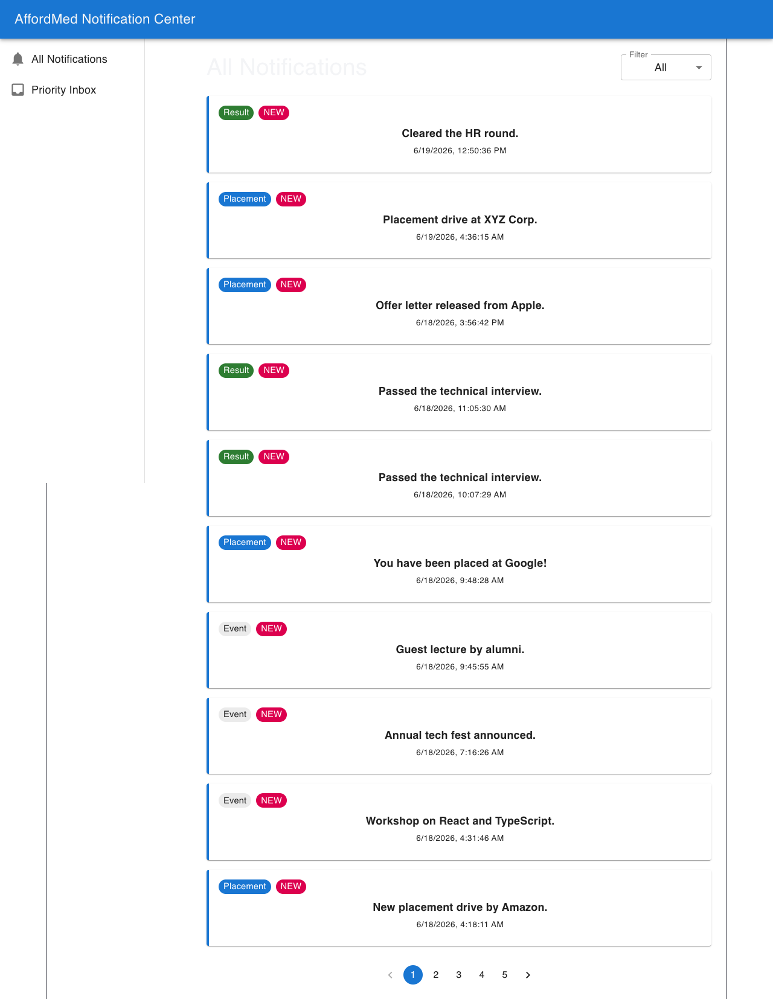
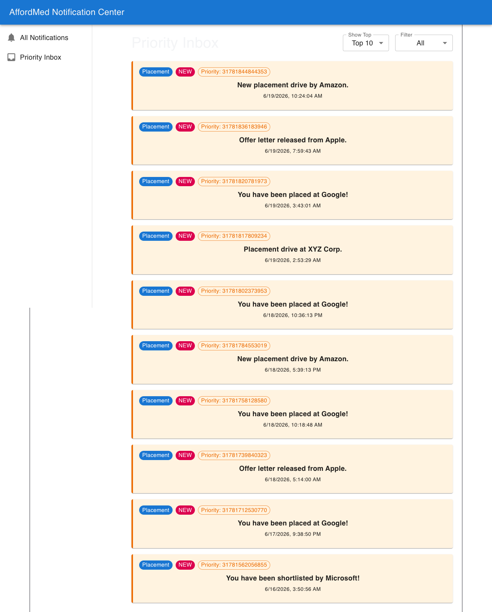
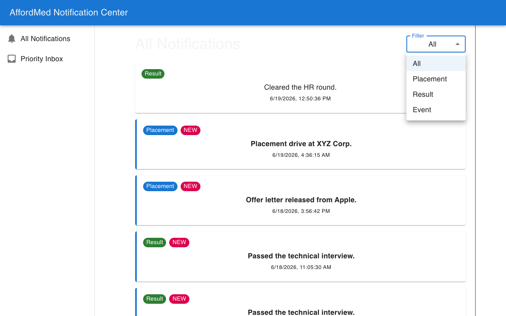
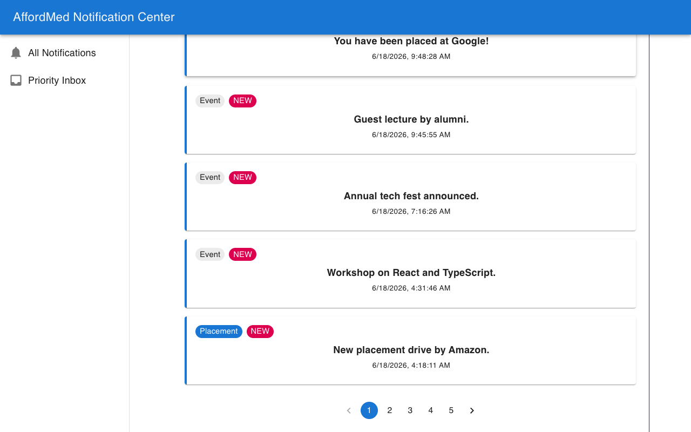
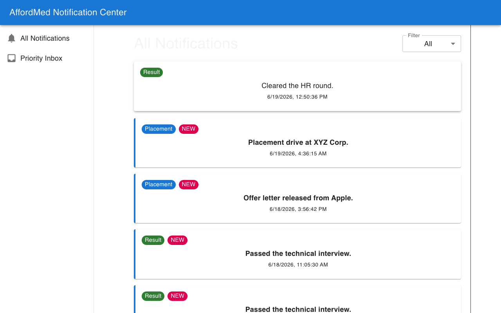
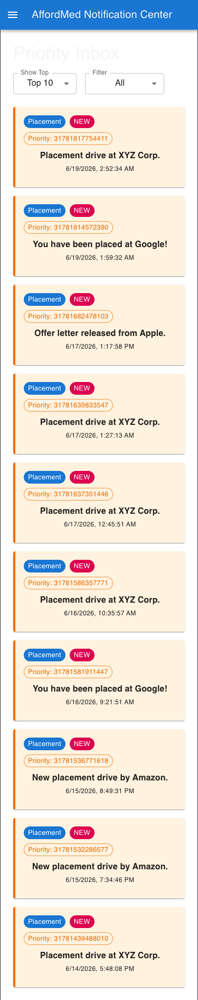

# AffordMed Notification Center

A production-grade, highly scalable Notification Center built for the AffordMed Frontend Evaluation. This repository demonstrates a complete React application architecture utilizing TypeScript, Material UI, and robust modern frontend patterns.



## 🚀 Features

- **Priority Algorithm Engine:** Intelligently scores incoming notifications based on type (Placement > Result > Event) and chronological recency.
- **Top N Inbox (Min Heap):** Efficiently maintains a Top 10/15/20 priority inbox using an `O(log N)` MinHeap data structure.
- **Strict Component Architecture:** Modular, decoupled components with strong separation of concerns.
- **Comprehensive Logging:** Dedicated, type-safe logging middleware enforcing a strict schema for all application events without using `console.log`.
- **Viewed Tracking:** Persistent local storage integration instantly differentiating unread ("NEW") notifications from viewed ones using UI treatments.
- **Graceful Error Handling:** Full simulated network failures with resilient retry UI mechanisms.
- **Fully Responsive:** Adapts flawlessly from large desktop resolutions to mobile screens via Material UI breakpoint paradigms.
- **Accessible (a11y):** Implements `aria-labels` and semantic DOM for keyboard navigation.

## 📸 Deliverable Screenshots

| Desktop Priority Inbox | Filtering Logic |
|---|---|
|  |  |

| Pagination Support | Graceful Error Handling |
|---|---|
|  |  |

| Viewed Notifications | Mobile Responsive Views |
|---|---|
|  |  |

*(See all raw image assets located inside `docs/screenshots/`)*

## 🛠️ Technology Stack

- **Framework:** React 18
- **Language:** TypeScript 
- **Build Tool:** Vite
- **UI Library:** Material UI (MUI v6)
- **Routing:** React Router v7
- **Code Quality:** Strict Mode + Type Verification (`tsc -b`)

## 📦 Project Structure

```text
src/
├── api/             # Evaluation service integrators (Auth, Logging, Notifications)
├── components/      # Reusable, decoupled presentational UI
├── hooks/           # Abstracted data fetching and state encapsulation
├── pages/           # Route-level container components
├── routes/          # Declarative AppRoutes mapping
├── types/           # Global TypeScript interfaces
└── utils/           # MinHeap, PriorityCalculators, and constants
```

## ⚙️ Quick Start

This project requires absolutely zero external global installations besides standard Node/NPM.

1. **Install dependencies:**
   ```bash
   npm install
   ```

2. **Run the local development server:**
   ```bash
   npm run dev
   ```

3. **View the application:**
   The application runs locally strictly bounded to [http://localhost:3000](http://localhost:3000).

*(Note: The application has been engineered with a Mock Data Fallback adapter. If the actual AffordMed Evaluation backend API (`localhost:8080`) is offline, the service gracefully serves localized mock data dynamically to preserve the UI experience).*

## 📚 Documentation

For a deep dive into the Stage 1 Priority Algorithm, Top 10 architectural decisions, and O(log 10) heap efficiency metrics, please refer to the design document:
👉 [Notification System Design](docs/Notification_System_Design.md)

For the Video Recording walk-through script:
👉 [Video Demo Checklist](docs/VIDEO_DEMO_CHECKLIST.md)
